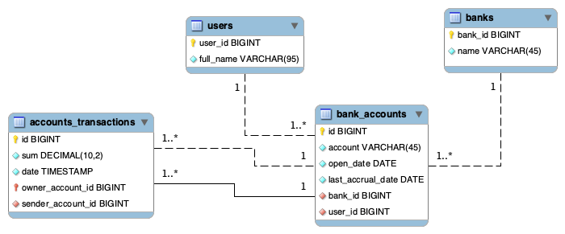

# Тестовое задание Clevertec
[Задание](Тестовое%20задание%20Clevertec%20Java.pdf)

## Описание предметной области
В данном проекте мы рассматриваем систему управления банковскими счетами. Основными объектами предметной области являются банки, пользователи, банковские счета и транзакции счетов.

### Банки:
- **Название**: Название банка.
- **Идентификатор банка**: Уникальный идентификатор банка.

### Пользователи:
- **Полное имя**: Полное имя пользователя.
- **Идентификатор пользователя**: Уникальный идентификатор пользователя.

### Банковские счета:
- **Номер счета**: Уникальный номер банковского счета.
- **Дата открытия**: Дата открытия счета.
- **Дата последнего начисления**: Дата последнего месячного начисления на счет.
- **Банковский идентификатор**: Ссылка на банк, к которому относится счет.
- **Пользовательский идентификатор**: Ссылка на пользователя, владельца счета.

### Транзакции счетов:
- **Сумма**: Сумма транзакции.
- **Дата и время**: Дата и время проведения транзакции.
- **Идентификатор отправителя**: Ссылка на банковский счет, с которого отправлена транзакция (если есть).
- **Идентификатор получателя**: Ссылка на банковский счет, на который зачислена транзакция.

## Схема базы данных.
<p align="center">
  
</p>

## Зависимости проекта:
- **jakarta.servlet:jakarta.servlet-api:5.0.0**: API для разработки веб-сервисов в Java.
- **org.projectlombok:lombok:1.18.28**: Аннотации и инструменты для уменьшения шаблонного кода.
- **org.yaml:snakeyaml:2.1**: Библиотека для работы с YAML-файлами.
- **com.fasterxml.jackson.core:jackson-databind:2.15.2**: Работа с JSON в Java.
- **org.aspectj:aspectjrt:1.9.19** и **org.aspectj:aspectjweaver:1.9.19**: Инфраструктура для аспектно-ориентированного программирования (AOP).
- **org.apache.bval:bval-jsr:2.0.6** и **jakarta.validation:jakarta.validation-api:2.0.2**: Валидация данных в Java.
- **org.modelmapper:modelmapper:3.1.1**: Преобразование объектов между моделями данных.
- **com.zaxxer:HikariCP:5.0.1**: Пул соединений для эффективной работы с базой данных.
- **org.postgresql:postgresql:42.6.0**: JDBC-драйвер для PostgreSQL.
- **org.apache.logging.log4j:log4j-api:2.20.0** и **org.apache.logging.log4j:log4j-core:2.20.0**: Логирование в приложении.
- **com.itextpdf:itextpdf:5.5.13.3**: Работа с PDF-документами в Java.

## Инструкция для запуска:
1. Убедитесь, что у вас установлен [Docker](https://docs.docker.com/get-docker/) и [Docker Compose](https://docs.docker.com/compose/install/).

2. Откройте терминал и перейдите в корневую директорию проекта, где находится файл `docker-compose.yml`.

3. Запустите команду:

   ```bash
   docker-compose up --build
Эта команда создаст и запустит контейнеры для приложения, PostgreSQL и PgAdmin.
После успешного запуска,  приложение будет доступно по адресу:
http://localhost:8080 - Java приложение.
http://localhost:5432 - PostgreSQL.
http://localhost:5050 - PgAdmin.

4. Тестирование API с помощью Postman:
 - Убедитесь, что у вас установлен Postman. Если нет, скачайте и установите Postman.
 - Откройте Postman и импортируйте файл [bank_clevertec.postman_collection.json](bank_clevertec.postman_collection.json), который содержит набор запросов для тестирования API.
 - В Postman выберите импортированный набор запросов и убедитесь, что в нем указана базовый URL-адрес (http://localhost:8080).
 - Запустите запросы для тестирования функциональности API. Вы можете выполнять запросы на создание, чтение, обновление и удаление данных.
5. В конце запустите команду и удалите image:

   ```bash
   docker-compose down --volumes

## CRUD операции с примерами входных и выходных данных
### Операции над пользователями
| Запрос           | Описание                            | Пример входных данных | Пример выходных данных |
|------------------|------------------------------------|-----------------------|-------------------------|
| `GET /users`     | Получение списка пользователей      | Не требуется           |   Список пользователей  |
| `GET /users/?id={id}`| Получение информации о пользователе| Параметр `id`         | Информация о пользователе|
| `POST /users`    | Создание нового пользователя       | Данные пользователя   | Созданный пользователь  |
| `PUT /users/`| Обновление информации о пользователе| Данные пользователя с id  | Обновленная информация  |
| `DELETE /users/?id={id}`| Удаление пользователя             | Параметр `id`         | Статус операции удаления|

Данные пользователя (id и fullName необходимы для обновления)
```json 
    {
        "id": 1, 
        "fullName": "John Doe 2"
    }
```

### Операции над банками
| Запрос           | Описание                            | Пример входных данных | Пример выходных данных |
|------------------|------------------------------------|-----------------------|-------------------------|
| `GET /banks`     | Получение списка банков             | Не требуется           | Список банков           |
| `GET /banks/?id={id}`| Получение информации о банке      | Параметр `id`         | Информация о банке      |
| `POST /banks`    | Создание нового банка               | Данные банка           | Созданный банк          |
| `PUT /banks/`| Обновление информации о банке   | Данные банка   | Обновленная информация  |
| `DELETE /banks/?id={id}`| Удаление банка                   | Параметр `id`         | Статус операции удаления|

Данные банка (id и name необходимы для обновления)
```json 
    {
    "id": 3,
    "name": "Bank Da"
}
```

### Операции над банковскими счетами

| Запрос                                                                                           | Описание                                     | Пример входных данных                                 | Пример выходных данных                            |
|--------------------------------------------------------------------------------------------------|---------------------------------------------|-------------------------------------------------------|---------------------------------------------------|
| `GET /bank/accounts`                                                                             | Получение списка банковских счетов          | Не требуется                                           | Список банковских счетов                          |
| `GET /bank/accounts?id={id}`                                                                    | Получение информации о банковском счете    | Параметр `id`                                          | Информация о банковском счете                      |
| `GET /bank/accounts?command=get_account_balance&id={id}`                                          | Получение баланса банковского счета         | Параметр `id`                                          | Баланс банковского счета                          |
| `GET /bank/accounts?command=GET_ACCOUNT_EXTRACT&id={id}&from={from}&to={to}`                     | Получение выписки по банковскому счету    | Параметры `id`, `from`, `to`                            | Выписка по банковскому счету                     |
| `GET /bank/accounts?command=GET_ACCOUNT_STATEMENT&id={id}&from={from}&to={to}`                   | Получение информации о полученных и потраченных средсв по счету    | Параметры `id`, `from`, `to`                            | Выписка по банковскому счету                     |
| `POST /bank/accounts`                                                                            | Создание нового банковского счета         | Данные банковского счета                               | Созданный банковский счет                        |
| `PUT /bank/accounts?id={id}`                                                                     | Обновление информации о банковском счете  | Параметр `id`, Данные банковского счета                  | Обновленная информация о банковском счете         |
| `DELETE /bank/accounts?id={id}`                                                                  | Удаление банковского счета                | Параметр `id`                                          | Статус операции удаления банковского счета        |

Параметры  `from`, `to`  - даты в формате "18-08-2023"
Данные для создания счета 
```json
{
    "account": "123126322",
    "bank":{
        "id":5
    },
    "user":{
        "id": 10
    }
}
```

Данные бакновского счета 
```json 
    {
    "id": 1,
    "account": "125612",
    "openDate": "2023-09-01",
    "lastAccrualDate": "2023-09-01",
    "bank": {
        "id": 1,
        "name": "Bank A"
    },
    "user": {
        "id": 1,
        "fullName": "John Doe"
    }
}
```

Данные выписки 
```json 
    {
    "account": {
        "id": 17,
        "account": "9999999991",
        "openDate": "2023-09-01",
        "lastAccrualDate": "2023-09-01",
        "bank": {
            "id": 5,
            "name": "Bank E"
        },
        "user": {
            "id": 9,
            "fullName": "James Garcia"
        }
    },
    "balance": 5050.00,
    "from": "2023-08-18",
    "to": "2023-08-18",
    "transactions": [
        {
            "id": 12,
            "sum": -2750.00,
            "from": {
                "id": 0
            },
            "to": {
                "id": 17
            },
            "dateTime": "2023-08-18T07:00:00"
        },
        {
            "id": 13,
            "sum": 4600.00,
            "from": {
                "id": 0
            },
            "to": {
                "id": 17
            },
            "dateTime": "2023-08-18T08:30:00"
        }
    ]
}
```
Данные информации о потраченных и полученных средств
```json 
    {
    "account": {
        "id": 1,
        "account": "125612",
        "openDate": "2023-09-01",
        "lastAccrualDate": "2023-09-01",
        "bank": {
            "id": 1,
            "name": "Bank A"
        },
        "user": {
            "id": 1,
            "fullName": "John Doe"
        }
    },
    "money": {
        "balance": 201.65,
        "income": 234.66,
        "expenditure": -33.01
    },
    "from": "2023-08-31",
    "to": "2023-09-30"
}
```
### Операции над банковскими транзакциями

| Запрос                                                                                           | Описание                                     | Пример входных данных                                 | Пример выходных данных                            |
|--------------------------------------------------------------------------------------------------|---------------------------------------------|-------------------------------------------------------|---------------------------------------------------|
| `GET /bank/transactions?command=GET_ALL_TRANSACTIONS_BY_ACCOUNT&account={account}`               | Получение всех транзакций по банковскому счету | Параметр `account`                                    | Список всех транзакций по счету                 |
| `GET /bank/transactions`                                                                         | Получение всех банковских транзакций      | Не требуется                                           | Список всех банковских транзакций               |
| `GET /bank/transactions?command=GET_ALL_TRANSACTIONS_BY_ACCOUNT_ID&account_id={account_id}`     | Получение всех транзакций по идентификатору счета | Параметр `account_id`                             | Список всех транзакций по идентификатору счета   |
| `GET /bank/transactions?id={id}`                                                                | Получение информации о транзакции       | Параметр `id`                                          | Информация о транзакции                         |
| `POST /bank/transactions?command=deposit`                                                        | Депозит (внесение средств)              | JSON-тело запроса с данными для депозита               | Информация о проведенной транзакции             |
| `POST /bank/transactions?command=withdrawal`                                                     | Вывод (снятие средств)                | JSON-тело запроса с данными для вывода средств         | Информация о проведенной транзакции             |
| `POST /bank/transactions?command=transfer`                                                       | Перевод между счетами                  | JSON-тело запроса с данными для перевода между счетами  | Информация о проведенной транзакции             |
| `DELETE /bank/transactions?id={id}`                                                              | Удаление транзакции                   | Параметр `id`                                          | Статус операции удаления транзакции             |


Тело запроса для создания
```json 
   {
    "sum": 112.33,
    "from": {
        "id": 5
    },
    "to": {
        "id": 1
    }
    
}
```

Данные о транзакции
```json 
    {
    "id": 1,
    "sum": 100.00,
    "from": {
        "id": 0,
        "bank": {},
        "user": {}
    },
    "to": {
        "id": 1,
        "account": "1111111111",
        "bank": {
            "name": "Bank A"
        },
        "user": {
            "fullName": "John Doe"
        }
    },
    "dateTime": "2023-08-15T10:30:00"
}
```

### Обработка ошибок
```json 
    {
    "code": 404,
    "message": "account is not found"
}
```

