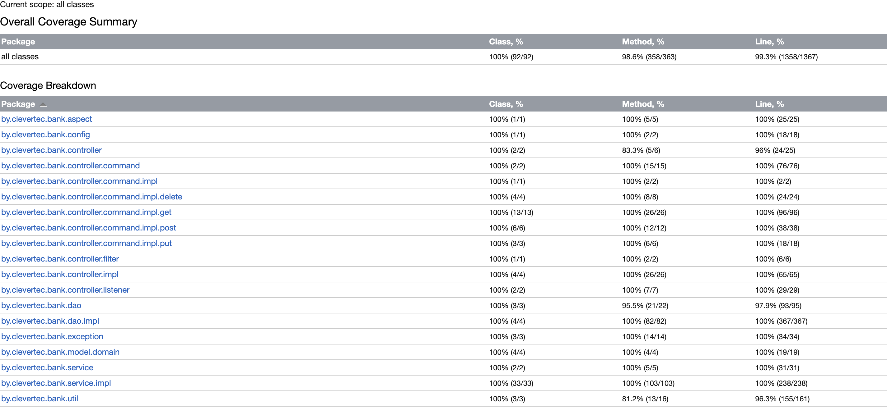
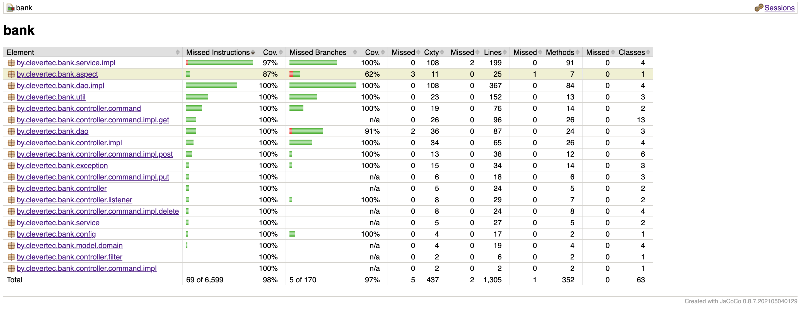

# Тестирование

### IDEA coverage report 

  

Class - 100%, Method - 98.6%, Line - 99.3%

Не протестировал private default конструкторы

--- 
### Jacoco coverage report

  

Не протестировал методы сгененрированные AspectJ для аспекта, но убрал из отчета классы Closure

Не понял как запустить тесты с testcontainers с помощью docker, пока пропускаю